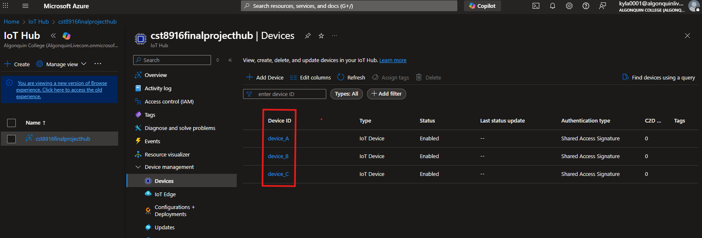
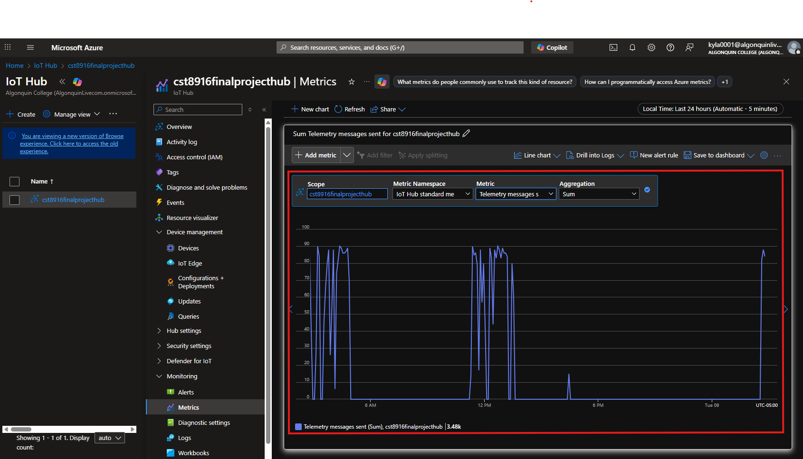
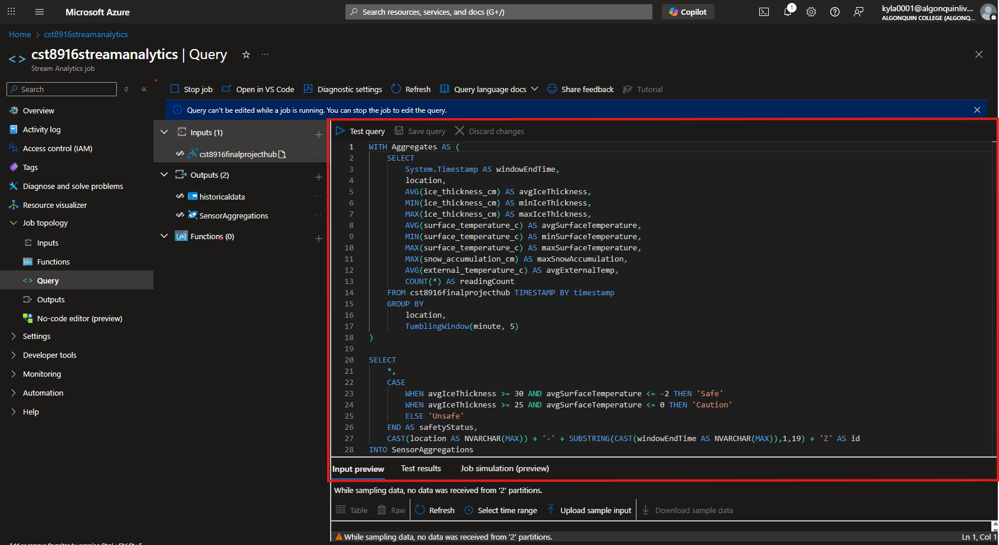
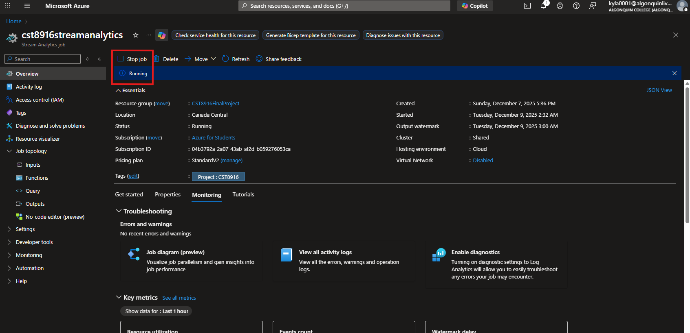
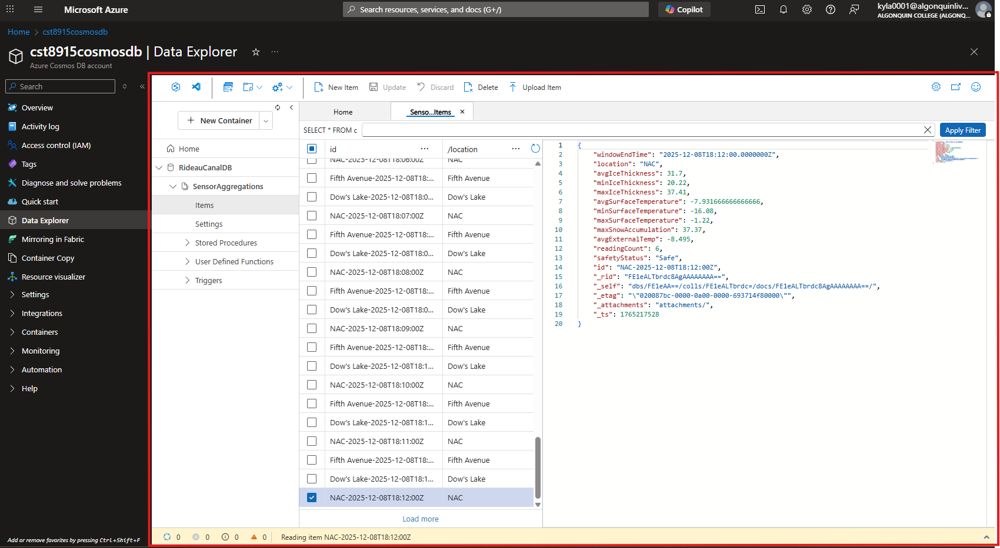
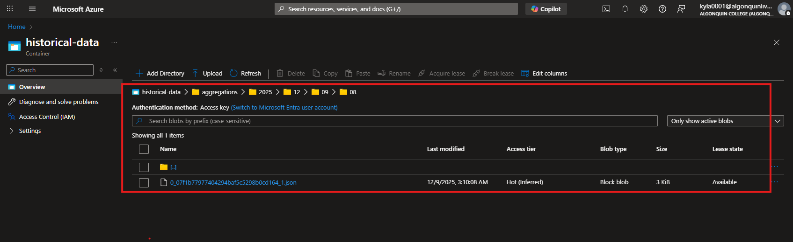
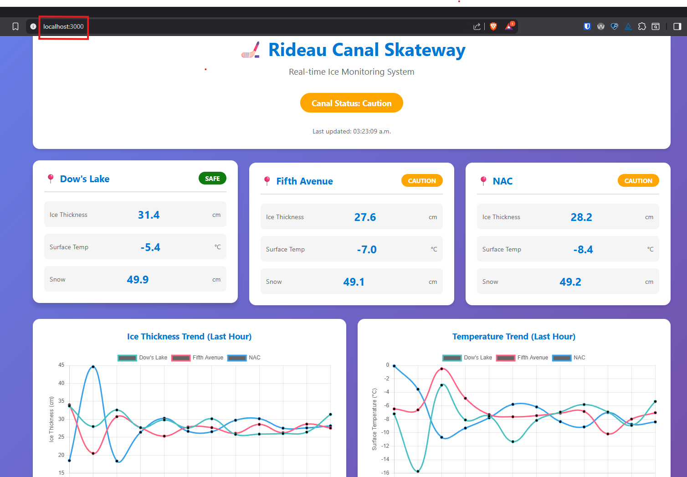
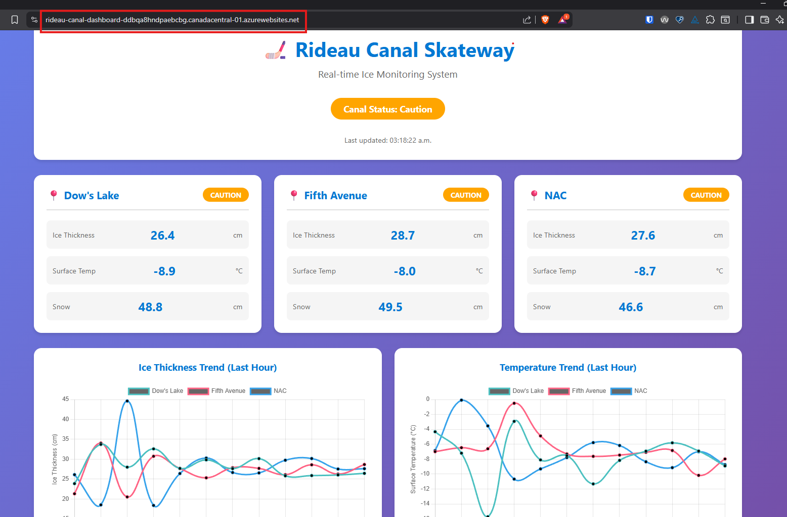

# CST8916 Final Project: Real-time Monitoring System for Rideau Canal Skateway

## Name: Kylath Mamman George

## Student Number: 041198835

## Repository Links

| Repository Name | Repository Link |
|----------|----------|
| Main Documentation Repository   | <https://github.com/KylathGeorge/CST8916-final-project>  |
| Sensor Simulation Repository    | <https://github.com/KylathGeorge/rideau-canal-sensor-simulation>   |
| Web Dashboard Repository    | <https://github.com/KylathGeorge/rideau-canal-dashboard>   |

## Scenario Overview

### Problem Statement

The National Capital Commission needs a real-time data streaming and visualization system to improve skater safety as currently there is no such system to collect and visualize data.

### System Objectives

1. Simulate IoT sensors at three locations—Dow's Lake, Fifth Avenue, and the National Arts Centre (NAC)—to monitor:

   - Ice Thickness (cm)
   - Surface Temperature (°C)
   - Snow Accumulation (cm)
   - External Temperature (°C)

2. Process sensor data in real-time using Azure Stream Analytics with 5-minute aggregation windows.

3. Store processed data in Azure Cosmos DB for fast, low-latency access.

4. Archive historical data in Azure Blob Storage for long-term retention and analysis.

5. Present live data through a web dashboard hosted on Azure App Service for real-time monitoring.

## System Architecture

### Diagram

### Data flow explanation

Looking at the data flow from this diagram, we have 3 IoT devices which are transmitting data each from a different location. These devices are managed by the Azure IoT hub and the data stream from each of the devices are streamed to Azure Stream Analytics. Once the data is processed, it is then moved to two different services: Azure Blob Storage and Azure Cosmos DB. Data is stored in blob storage aggregated by the date and time in a JSON format. The data is also stored in an Azure Cosmos DB and accessed by the front end web service using Azure App Service.

### Azure Services used

- Azure IoT Hub
- Azure Stream Analytics
- Azure Storage accounts/Blob Storage
- Azure Cosmos DB
- Azure App Services

## Implementation Overview

IoT Sensor Simulation: <https://github.com/KylathGeorge/rideau-canal-sensor-simulation>

## Video Demonstration

Demo video link: [Final Project](https://www.youtube.com/watch?v=UhFq0rlXJZQ)

## Setup Instructions

1. Setup Azure IoT Hub
   - In the Azure Portal, search for IoT Hub and click Create.
   - Provide a name for your IoT Hub and select a resource group.
   - Create the IoT Hub.

2. Register 3 Devices

   - In the IoT Hub, go to the Devices section and click Add Device.
   - Provide a Device ID (e.g., Sensor1) and click Save.
   - After the device is created, click on it to view the connection string. Copy the connection string for use in the environment variables.

3. Install required libraries shown in the repository links

## Results and Analysis

1. IoT Hub with 3 registered devices

    

2. IoT Hub metrics showing messages received

    

3. Stream Analytics query editor with your query

    

    

4. Stream Analytics job in "Running" state

    

5. Cosmos DB Data Explorer with sample documents

    

6. Blob Storage container with archived files

    

7. Dashboard running locally (showing live data)

    

8. Dashboard deployed on Azure App Service

    

I did not notice any big issues in terms of performance, when the simulation and stream analytics job was started, a spike in CPU and Memory utilization was observed as well as a 6.14 second watermark delay. However this dropped afterwards to about half of its original value for CPU usage and watermark delay.

The biggest issue was having a working query, there was some time spent debugging because I had one of the query fields named wrong and only some of the metrics was showing up on the dashboard. I also had an issue where app service would not display the dashboard, but re-creating the app service worked for some reason.

## Challenges and Solutions

It was a challenge to create the query needed as I had some issues with the time format not writing into the Cosmos DB as well as not realizing my query variables did not match the variables in the backend, however both issues were resolved.

## AI Tools Used

- **Tool:** ChatGPT

- **Purpose:** Query generation, debugging some issues.

- **Extent:** AI was used to help create and debug the query for Azure Stream Analytics, as well as debug the python code for issues with simulating data such as timestamps with microseconds causing issues.
  