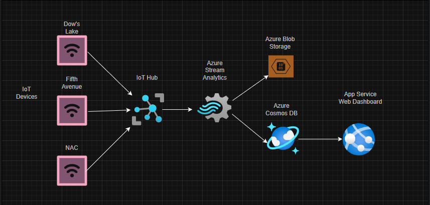

# CST8916 Final Project: Real-time Monitoring System for Rideau Canal Skateway

## Name: Kylath Mamman George

## Student Number: 041198835

## Repository Links

| Repository Name | Repository Link |
|----------|----------|
| Main Documentation Repository   | <https://github.com/KylathGeorge/CST8916-final-project>  |
| Sensor Simulation Repository    | <https://github.com/KylathGeorge/rideau-canal-sensor-simulation>   |
| Web Dashboard Repository    | <https://github.com/KylathGeorge/rideau-canal-dashboard>   |

## Scenario Overview

### Problem Statement

The National Capital Commission needs a real-time data streaming and visualization system to improve skater safety as currently there is no such system to collect and visualize data.

### System Objectives

1. Simulate IoT sensors at three locations—Dow's Lake, Fifth Avenue, and the National Arts Centre (NAC)—to monitor:

   - Ice Thickness (cm)
   - Surface Temperature (°C)
   - Snow Accumulation (cm)
   - External Temperature (°C)

2. Process sensor data in real-time using Azure Stream Analytics with 5-minute aggregation windows.

3. Store processed data in Azure Cosmos DB for fast, low-latency access.

4. Archive historical data in Azure Blob Storage for long-term retention and analysis.

5. Present live data through a web dashboard hosted on Azure App Service for real-time monitoring.

## System Architecture

### Diagram



### Data flow explanation

Looking at the data flow from this diagram, we have 3 IoT devices which are transmitting data each from a different location. These devices are managed by the Azure IoT hub and the data stream from each of the devices are streamed to Azure Stream Analytics. Once the data is processed, it is then moved to two different services: Azure Blob Storage and Azure Cosmos DB. Data is stored in blob storage aggregated by the date and time in a JSON format. The data is also stored in an Azure Cosmos DB and accessed by the front end web service using Azure App Service.

### Azure Services used

- Azure IoT Hub
- Azure Stream Analytics
- Azure Storage accounts/Blob Storage
- Azure Cosmos DB
- Azure App Services

## Implementation Overview

IoT Sensor Simulation: <https://github.com/KylathGeorge/rideau-canal-sensor-simulation>

## Video Demonstration

## Setup Instructions

1. Setup Azure IoT Hub with 3 devices, Azure Blob Storage and Cosmos DB.
2. Deploy Dashboard to Azure App Service with environment variables set as shown in `.env.example`.
3. Have environment variables set up in Azure
4. Install Python and run `python sensor_simulation.py` in the simulation directory to run it locally following the `.env.example` file for env variables.
5. Install Node.js and run the following in the web dashboard directory:

    ```command
        npm install
        node server.js
    ```

## Results and Analysis

## Challenges and Solutions

It was a challenge to create the query needed as I had some issues with the time format not writing into the Cosmos DB as well as not realizing my query variables did not match the variables in the backend, however both issues were resolved.

## AI Tools Disclosure

AI was used to help create and debug the query for Azure Stream Analytics, as well as debug the python code for issues with simulating data.
